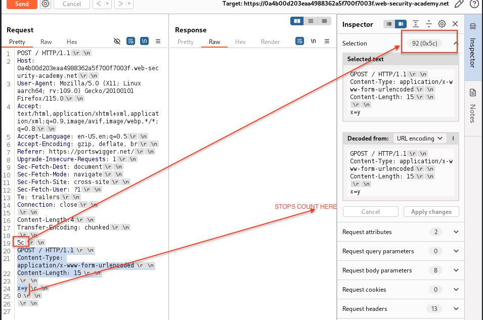
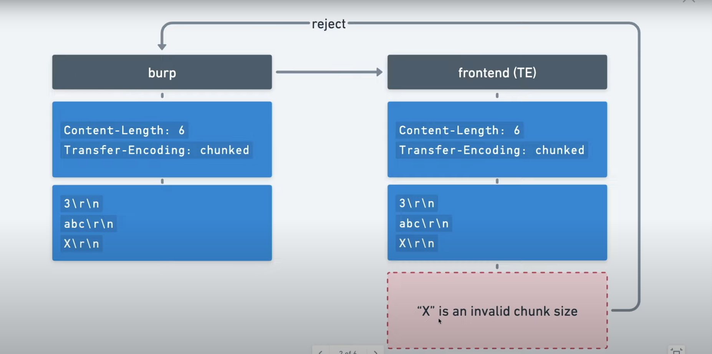
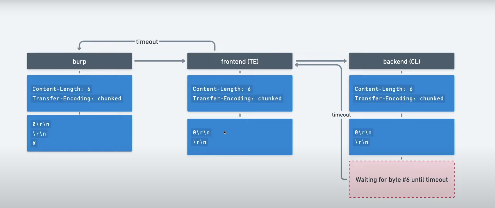
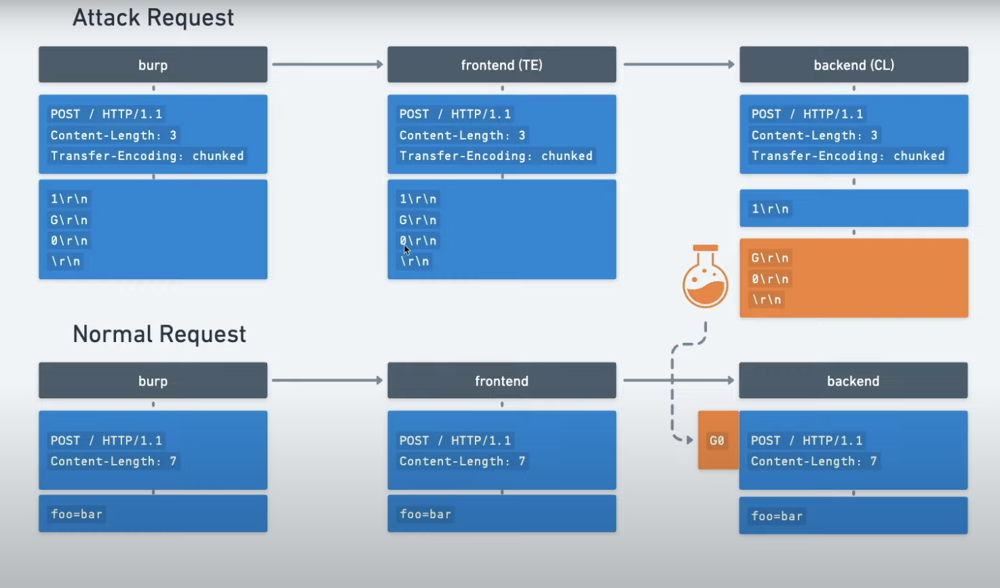

- inserting or "smuggling" an additional request within the initial request
	- front-end and back-end will process this as 2 separate requests
- desynchronization between the front-end and backend
- innocent request must be `POST`
	
# Content-Length
- uses decimal to represent the bytes/characters
# Transfer Encoding

- `TE` uses hexadecimal representation to represent the bytes/characters
	- each hexadecimal representation indicates the the chunk size
		- hence, size `0`  indicates that the next chunk is 0 bytes, which terminates the preceding chunk
# Performing HTTP Request Smuggling Attack
## HTTP Request Smuggling Methodology
1. Send the request to *Repeater*
2. downgrade the protocol from `HTTP/2` to `HTTP/1`
3. change request method to `POST` (right click > *change request method*)
4. uncheck *update Content-Length* (settings icon in *Repeater* > *Update Content-Length*)
5. show non-printable characters (`\n` icon on the top right of the request)
6. ensure that there is carriage return `\r\n` between request headers and request body
7. send the request as a sanity check
	- make sure to get back `200 OK`
8. check with the following method:
	- if reject (`400 Bad Request`)
	- if server timeout 
		- attack is as follows:
## `CL.TE`
- front-end uses `Content-Length` and backend uses `Transfer-Encoding`
- when both are present, `TE` overrides `CL`

- sometimes `Transfer-Encoding` can be blacklisted by the front-end. 
- always place a carriage return before the `0`
### `CL.TE` With Incomplete Smuggled Request:
#### Structure of MalIcious Request:

#### Incomplete Smuggling Process

Lab: [HTTP request smuggling, basic CL.TE vulnerability](../../../../writeups/portswigger/HTTP%20request%20smuggling,%20basic%20CL.TE%20vulnerability.md)
## `TE.CL`
- front-end uses `Transfer-Encoding` and backend uses `Content-Length`
	```
		POST / HTTP/1.1
		Host: vulnerable-website.com
		Content-Length: 3
		Transfer-Encoding: chunked
		
		8\r\n
		SMUGGLED\r\n
		0\r\n
	```
- front-end checks that there is 8 bytes from the chunk size given (`8`)
- backend then checks the `Content-Length`, which is 3
	- everything after that will be a second request (our smuggled request)
		- hence everything after `8\r\n` will be smuggled
- put a carriage return `\r\n` before the `0`
Lab: [HTTP request smuggling, basic TE.CL vulnerability](../../../../writeups/portswigger/HTTP%20request%20smuggling,%20basic%20TE.CL%20vulnerability.md)

## `TE.TE`: Obfuscating TE Header
- both front-end and backend servers both support `Transfer-Encoding` header, but one of the servers can be induced to not process it by obfuscating the header
	- Some ways: 
		```
			Transfer-Encoding: xchunked
			
			Transfer-Encoding : chunked
			
			Transfer-Encoding: chunked
			Transfer-Encoding: x
			
			X:X[\n]Transfer-Encoding: chunked
			
			Transfer-Encoding:[tab]chunked
			
			[space]Transfer-Encoding: chunked
			
			Transfer-Encoding
			: chunked 
		```
- determine whether the front-end or back-end can be induced to process the duplicate obfuscated header
Labs:
[HTTP request smuggling, confirming a CL.TE vulnerability via differential responses](../../../../writeups/portswigger/HTTP%20request%20smuggling,%20confirming%20a%20CL.TE%20vulnerability%20via%20differential%20responses.md)
